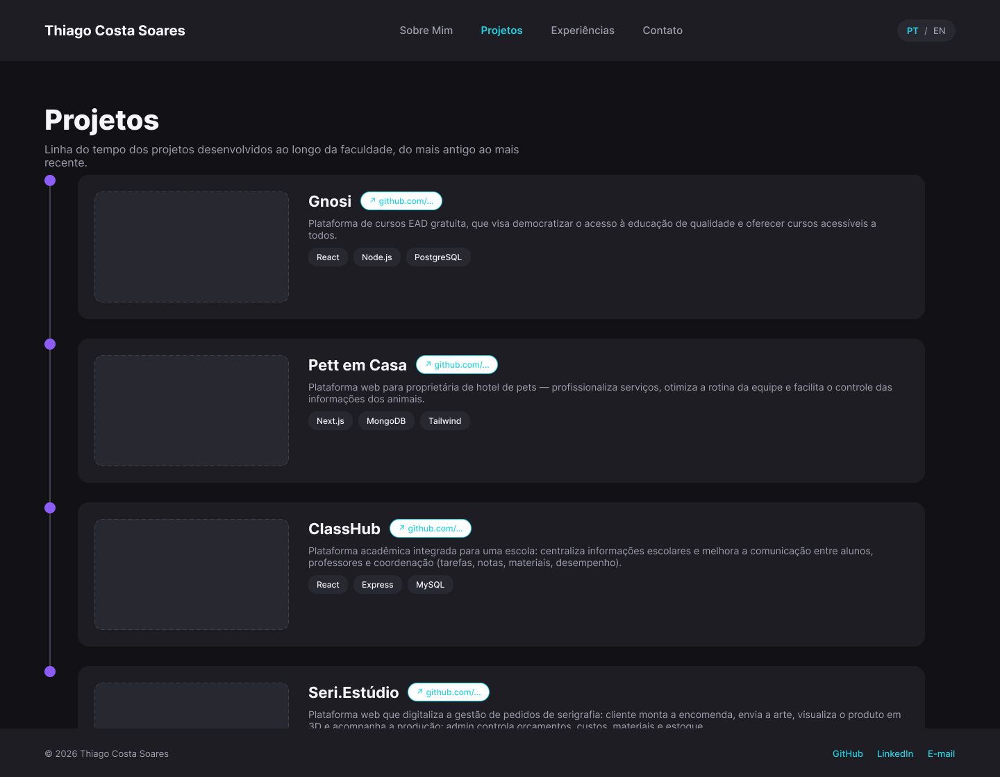
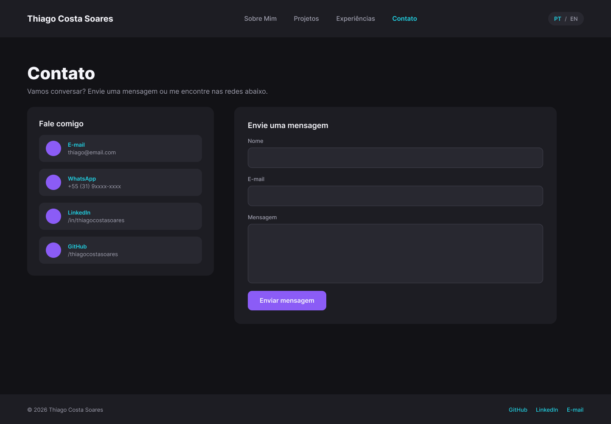

# 💼 Portfólio Profissional — Thiago Costa Soares

Website de portfólio profissional desenvolvido para a disciplina **Projeto de Software** (Engenharia de Software — PUC Minas), Laboratório 1 — Segundo Semestre/2026.

## 📌 Sobre o projeto

O objetivo deste site é apresentar minha trajetória, habilidades, projetos acadêmicos e formas de contato de maneira moderna e acessível. O sistema é dividido em 4 seções principais, navegáveis por um menu:

- **Sobre Mim** — apresentação pessoal em português e inglês, com formação, área de atuação, interesses e objetivos profissionais.
- **Projetos** — linha do tempo com os projetos desenvolvidos ao longo da faculdade, do mais antigo ao mais recente.
- **Experiências** — estágios, freelas e participações em projetos open source ou eventos técnicos.
- **Contato** — ícones clicáveis (e-mail, WhatsApp, LinkedIn) e formulário de envio de mensagem.

## 👤 Sobre mim

**Thiago Costa Soares**
Estudante de Engenharia de Software (PUC Minas) e estagiário de Microsoft 365 & Infraestrutura.

## 🎨 Protótipos (Figma)

Os wireframes de média fidelidade das 4 telas foram criados no Figma:

🔗 **[Ver protótipo completo no Figma](https://www.figma.com/design/KksQRuCeHzhGVKkp1Qg1e3)**

| Tela | Preview |
|---|---|
| Sobre Mim |  |
| Projetos |  |
| Experiências |  |
| Contato |  |

> 📎 Exports do Figma em PNG, disponíveis em `public/images/`.

**Identidade visual definida:** tema dark, paleta roxo (`#8B5CF6`) e ciano (`#21D3E5`) como cores de destaque, tipografia Inter.

## 🛠️ Tecnologias previstas

**Front-end**
- [Next.js](https://nextjs.org/) (React) — framework fullstack com SSR
- [React](https://react.dev/)
- Tailwind CSS (estilização)

**Back-end**
- API Route do Next.js (`src/app/api/contato/route.ts`) + [Resend](https://resend.com/) — envio de e-mail do formulário de contato

### Configurar o envio de e-mail (Resend)

1. Crie uma conta gratuita em [resend.com](https://resend.com/) usando o e-mail `thiag0cs@outlook.com` (é para onde as mensagens do formulário chegam).
2. Gere uma API Key no painel do Resend.
3. Rode `cp .env.local.example .env.local` e cole a chave em `RESEND_API_KEY`.
4. No deploy (Vercel), adicione a mesma variável `RESEND_API_KEY` em Project Settings → Environment Variables.

**Hospedagem**
- [Vercel](https://vercel.com/) (front-end + API routes em Next.js)

**Design**
- Figma (wireframes e protótipos)

## 📁 Estrutura inicial do projeto (planejada)

```
portfolio-thiago/
├── public/
│   └── images/              # imagens dos projetos, avatar, wireframes exportados, etc.
├── src/
│   ├── app/                 # rotas (Next.js App Router)
│   │   ├── page.tsx          # Sobre Mim (home)
│   │   ├── projetos/
│   │   │   └── page.tsx
│   │   ├── experiencias/
│   │   │   └── page.tsx
│   │   ├── contato/
│   │   │   └── page.tsx
│   │   └── api/
│   │       └── contato/
│   │           └── route.ts  # endpoint de envio de e-mail
│   ├── components/
│   │   ├── Navbar.tsx
│   │   ├── Footer.tsx
│   │   ├── ProjectCard.tsx
│   │   ├── ExperienceCard.tsx
│   │   └── ContactForm.tsx
│   ├── data/
│   │   ├── projects.ts
│   │   └── experiences.ts
│   └── styles/
│       └── globals.css
├── package.json
└── README.md
```

> Estrutura sujeita a ajustes conforme o desenvolvimento avança nas próximas sprints.

## 🗺️ Progresso (Sprints)

- [x] **Lab01S01** — Planejamento e prototipação (repositório, wireframes, protótipo inicial de front-end, navegação e layout base)
- [x] **Lab01S02** — Implementação das funcionalidades principais (Sobre Mim PT/EN, Projetos com timeline, Experiências, Contato com formulário funcional)
- [ ] **Lab01S03** — Deploy, ajustes finais, imagens/GIFs dos projetos, README final

## 🚧 Status

Projeto em desenvolvimento — instruções de instalação e execução local, dependências completas e link do site publicado serão adicionados ao final do projeto (Lab01S03).
